# POST `/api/LMU/details` — Endpoint Flow

## Overview

Returns LMU (Last-Minute Upgrade) upgrade details for a record locator: upgrade wording/title/benefits, passenger list, flight segments with business class availability, and pricing from LMUPriceRule.

| Property      | Value                                       |
| ------------- | ------------------------------------------- |
| Method        | `POST`                                      |
| Route         | `api/LMU/details`                           |
| Auth          | Optional (affects special quota pricing)    |
| Request Body  | `LMUDetailsRequest`                         |
| Response      | `LMUDetailsEnvelopeResponse` (200/400)      |
| Cache         | Redis (`LMU:Details:{pnr}:{carrier}`)       |
| Session       | Sabre SOAP (Create → Retrieve → Close)      |

---

## Request / Response

### Request — `LMUDetailsRequest`

```json
{ "recordLocator": "ABC123" }
```

| Field           | Type     | Required | Notes                                    |
| --------------- | -------- | -------- | ---------------------------------------- |
| `recordLocator` | `string` | Yes      | PNR / record locator (trimmed & uppered) |

### Response — `LMUDetailsEnvelopeResponse`

```json
{
  "success": true,
  "message": null,
  "recordLocator": "ABC123",
  "wording": {
    "title": "...",
    "benefits": [...],
    "logoItems": [...],
    "policyCards": [...],
    "baggageIncluded": { "oldWeightKg": 20, "newWeightKg": 30, "unit": "kg" },
    "disclaimer": "...",
    "remainingSeatsText": "Tersedia 2 kursi lagi"
  },
  "passengers": [
    {
      "firstName": "John",
      "lastName": "Doe",
      "title": "MR",
      "note": "ADT",
      "passengerNumber": 1,
      "nameId": "1",
      "isBCMember": false,
      "eligibility": "Eligible",
      "eligibilityText": "...",
      "ticketNumber": "*****"
    }
  ],
  "segments": [
    {
      "flightNumber": "123",
      "carrierCode": "ID",
      "origin": "CGK",
      "destination": "DPS",
      "departureDateTime": "...",
      "arrivalDateTime": "...",
      "carrierDisplayName": "...",
      "businessClassAvailable": true,
      "remainingSeat": 3,
      "originName": "...",
      "destinationName": "...",
      "aircraftName": "Airbus A320",
      "durationMinutes": 120,
      "timeWindowMatched": true,
      "segmentSequenceNumber": 1
    }
  ],
  "totalDurationMinutes": 120,
  "price": { "adult": 350000, "infant": 0 },
  "currency": "IDR",
  "isSpecialQuotaAvailable": false,
  "remainingDurationSeconds": 900,
  "isBookCabin": false,
  "cabinPoints": { "adult": 100, "infant": 0 }
}
```

### Error Codes (InternalMessage → ErrorCode)

| InternalMessage         | ErrorCode                      | HTTP |
| ----------------------- | ------------------------------ | ---- |
| `RecordLocatorRequired` | `RecordLocatorRequired`        | 400  |
| `RecordLocatorNotFound` | `RecordLocatorNotFound`        | 400  |
| `already business Class`| `AlreadyBusinessClass`         | 400  |
| `HasAncillaryServicesExcl99` | `HasAncillaryServicesExcl99` | 400 |
| `MultipleSegments`      | `MultipleSegments`             | 400  |
| `VcrStatusNotEligible`  | `VcrStatusNotEligible`         | 400  |
| `BusinessClassFull`     | `DetailsFailed`                | 400  |
| `QuotaExceeded`         | `DetailsFailed`                | 400  |
| `CreateSessionFailed`   | `DetailsFailed`                | 400  |
| `ServiceError`          | `DetailsFailed`                | 400  |

---

## Flow Diagram

```
┌─────────────────────────────────────────────────────────────────────────┐
│                      Client  POST /api/LMU/details                     │
│                        { "recordLocator": "ABC123" }                   │
└───────────────────────────────┬─────────────────────────────────────────┘
                                │
                                ▼
┌─────────────────────────────────────────────────────────────────────────┐
│  ApiController.Details()                                               │
│  ├─ Validate request (null check, recordLocator required)              │
│  ├─ Normalize: trim + uppercase                                        │
│  └─ Call _detailsProvider.GetDetailsAsync()                            │
└───────────────────────────────┬─────────────────────────────────────────┘
                                │
                                ▼
┌─────────────────────────────────────────────────────────────────────────┐
│  LMUDetailsProvider.GetDetailsAsync()                                  │
│                                                                         │
│  ┌──────────────────────────────────────────────────────────────────┐   │
│  │ STEP 0: CACHE LOOKUP                                            │   │
│  │ ├─ Cache key: LMU:Details:{recordLocator}:{carrierCode}         │   │
│  │ ├─ If hit → reset timer, refresh loyalty IDs, refresh price     │   │
│  │ │   → return cached response (skip Sabre calls)                 │   │
│  │ └─ If miss → continue to Sabre flow                             │   │
│  └──────────────────────────┬───────────────────────────────────────┘   │
│                             │ (cache miss)                              │
│                             ▼                                           │
│  ┌──────────────────────────────────────────────────────────────────┐   │
│  │ STEP 1: CREATE SABRE SESSION                                    │   │
│  │ ├─ SabreSoapService.CreateSessionAsync(carrierCode)             │   │
│  │ ├─ Returns: BinarySecurityToken, PseudoCityCode                 │   │
│  │ └─ On failure → InternalMessage="CreateSessionFailed" → return  │   │
│  └──────────────────────────┬───────────────────────────────────────┘   │
│                             │                                           │
│                             ▼                                           │
│  ┌──────────────────────────────────────────────────────────────────┐   │
│  │ STEP 2: RETRIEVE RESERVATION                                    │   │
│  │ ├─ SabreSoapService.GetReservationAsync(recordLocator, token)   │   │
│  │ └─ On failure → InternalMessage="RecordLocatorNotFound" → return│   │
│  └──────────────────────────┬───────────────────────────────────────┘   │
│                             │                                           │
│                             ▼                                           │
│  ┌──────────────────────────────────────────────────────────────────┐   │
│  │ STEP 3: INITIALIZE WORDING (Title, Benefits, PolicyCards, etc.) │   │
│  └──────────────────────────┬───────────────────────────────────────┘   │
│                             │                                           │
│                             ▼                                           │
│  ┌──────────────────────────────────────────────────────────────────┐   │
│  │ STEP 4: VALIDATION GATES (all return early on failure)          │   │
│  │ │                                                                │   │
│  │ ├─ AlreadyBusinessClass? (any BC segment)                       │   │
│  │ │   → InternalMessage="already business Class"                  │   │
│  │ ├─ HasAncillaryServicesExcl99? (when config enabled)           │   │
│  │ │   → InternalMessage="HasAncillaryServicesExcl99"              │   │
│  │ ├─ MultipleSegments? (when config enabled)                      │   │
│  │ │   → InternalMessage="MultipleSegments"                        │   │
│  │ └─ RouteWhitelist? (phased rollout gate)                        │   │
│  │     → InternalMessage="RouteNotWhitelisted"                     │   │
│  └──────────────────────────┬───────────────────────────────────────┘   │
│                             │ (all passed)                              │
│                             ▼                                           │
│  ┌──────────────────────────────────────────────────────────────────┐   │
│  │ STEP 5: BOOKCABIN CHECK                                        │   │
│  │ ├─ If receivedFrom == "BOOKCABIN" → IsBookCabin = true          │   │
│  │ ├─ Fetch itinerary via ItineraryService                         │   │
│  │ └─ Fire background task: fetch member profiles & cache          │   │
│  └──────────────────────────┬───────────────────────────────────────┘   │
│                             │                                           │
│                             ▼                                           │
│  ┌──────────────────────────────────────────────────────────────────┐   │
│  │ STEP 6: PARSE PASSENGERS                                        │   │
│  │ ├─ Parse from reservation JSON (ADT, CNN, INF)                  │   │
│  │ └─ Apply loyalty IDs from cache (BookCabin members)             │   │
│  └──────────────────────────┬───────────────────────────────────────┘   │
│                             │                                           │
│                             ▼                                           │
│  ┌──────────────────────────────────────────────────────────────────┐   │
│  │ STEP 7: TICKETING & VCR ELIGIBILITY CHECK                      │   │
│  │ ├─ GetTicketDetailsAndCouponStatusesAsync (Sabre batch)         │   │
│  │ ├─ Per-passenger: Eligible / Already Checkin / Not eligible     │   │
│  │ └─ Apply departure window (11h–1h before departure)             │   │
│  │     ├─ If within window → keep "Eligible"                       │   │
│  │     └─ If outside window → downgrade to "Not eligible"          │   │
│  │                                                                  │   │
│  │ ❌ No eligible passenger? → VcrStatusNotEligible → return       │   │
│  └──────────────────────────┬───────────────────────────────────────┘   │
│                             │ (≥1 eligible passenger)                   │
│                             ▼                                           │
│  ┌──────────────────────────────────────────────────────────────────┐   │
│  │ STEP 8: BUSINESS CLASS INVENTORY CHECK                          │   │
│  │ ├─ GetSegmentsWithBusinessClassAvailabilityAsync (Sabre)        │   │
│  │ ├─ Filter duplicate route segments                              │   │
│  │ └─ If no BC available → InternalMessage="BusinessClassFull"     │   │
│  └──────────────────────────┬───────────────────────────────────────┘   │
│                             │ (BC available)                            │
│                             ▼                                           │
│  ┌──────────────────────────────────────────────────────────────────┐   │
│  │ STEP 9: PRICE RESOLUTION (LMUDetailsPriceResolver)             │   │
│  │ │                                                                │   │
│  │ ├─ Filter ID-carrier segments with BC availability              │   │
│  │ ├─ STEP 9a: Quota Check (per segment)                          │   │
│  │ │   └─ If used + paxCount > maxQuota → QuotaExceeded → return  │   │
│  │ │                                                                │   │
│  │ ├─ STEP 9b: Special Quota Pricing (BookCabin + auth only)      │   │
│  │ │   ├─ Per-segment: eligibility window + LMUPriceRule match    │   │
│  │ │   ├─ If rule.MaxQuotaSpecial > 0 → special (free) price     │   │
│  │ │   └─ Remaining passengers → normal price                     │   │
│  │ │                                                                │   │
│  │ └─ STEP 9c: Normal Pricing (LMUPriceRule)                      │   │
│  │     ├─ Resolve domestic/international via airport country API   │   │
│  │     ├─ Match time window + duration → price per segment        │   │
│  │     └─ Sum all segment prices → total pricePerPax              │   │
│  │                                                                  │   │
│  │ Set: Price, Currency, CabinPoints, IsSpecialQuotaAvailable      │   │
│  └──────────────────────────┬───────────────────────────────────────┘   │
│                             │                                           │
│                             ▼                                           │
│  ┌──────────────────────────────────────────────────────────────────┐   │
│  │ STEP 10: BAGGAGE WEIGHTS                                       │   │
│  │ ├─ RefAirlineBaggage → old (Economy) / new (Business) kg       │   │
│  │ └─ Set Wording.BaggageIncluded                                  │   │
│  └──────────────────────────┬───────────────────────────────────────┘   │
│                             │                                           │
│                             ▼                                           │
│  ┌──────────────────────────────────────────────────────────────────┐   │
│  │ STEP 11: BOOKING TIMER & UNIQUE ID                             │   │
│  │ ├─ BatasPemesananStartedAt = now (Unix seconds)                │   │
│  │ ├─ RemainingDurationSeconds = CacheTtlMinutes × 60             │   │
│  │ └─ UniqueId = "10" + base36(timestamp) + random                │   │
│  └──────────────────────────┬───────────────────────────────────────┘   │
│                             │                                           │
│                             ▼                                           │
│  ┌──────────────────────────────────────────────────────────────────┐   │
│  │ STEP 12: CACHE WRITE & QUOTA HOLD                              │   │
│  │ ├─ If special quota passengers > 0                              │   │
│  │ │   └─ TryReserveDetailsFreeHoldAsync (Redis decrement)         │   │
│  │ │       └─ If fail → QuotaExceeded → return                    │   │
│  │ └─ SetCacheAsync → LMU:Details:{pnr}:{carrier} (TTL = config) │   │
│  └──────────────────────────┬───────────────────────────────────────┘   │
│                             │                                           │
│                             ▼                                           │
│  ┌──────────────────────────────────────────────────────────────────┐   │
│  │ STEP 13: CLOSE SABRE SESSION (finally block)                   │   │
│  │ └─ SabreSoapService.CloseSessionAsync(token, pcc)              │   │
│  └──────────────────────────┬───────────────────────────────────────┘   │
│                             │                                           │
│                             ▼                                           │
│  ┌──────────────────────────────────────────────────────────────────┐   │
│  │ STEP 14: MASK TICKET NUMBERS                                   │   │
│  │ └─ Replace all passenger ticketNumber with "*****"              │   │
│  └──────────────────────────┬───────────────────────────────────────┘   │
│                             │                                           │
│                             ▼                                           │
│              Return LMUDetailsEnvelopeResponse (200 OK)                │
└─────────────────────────────────────────────────────────────────────────┘
```

---

## Mermaid Sequence Diagram

```mermaid
sequenceDiagram
    participant Client
    participant ApiController
    participant DetailsProvider
    participant Cache as Redis Cache
    participant Sabre as Sabre SOAP API
    participant Ticketing as Ticketing Service
    participant Inventory as BC Inventory
    participant PriceResolver as Price Resolver
    participant QuotaRepo as Quota Repository
    participant PriceRuleRepo as PriceRule Repository
    participant RefData as Reference Data API

    Client->>ApiController: POST /api/LMU/details<br/>{"recordLocator":"ABC123"}
    ApiController->>ApiController: Validate & normalize request

    ApiController->>DetailsProvider: GetDetailsAsync("ABC123", "ID", lang, useCache=true)

    Note over DetailsProvider: STEP 0: Cache Lookup
    DetailsProvider->>Cache: GET LMU:Details:ABC123:ID
    alt Cache Hit
        Cache-->>DetailsProvider: cached JSON
        DetailsProvider->>DetailsProvider: Reset timer, refresh loyalty, refresh price
        DetailsProvider-->>ApiController: LMUDetailsResponse (from cache)
    else Cache Miss
        Note over DetailsProvider: STEP 1: Create Sabre Session
        DetailsProvider->>Sabre: CreateSessionAsync(carrierCode="ID")
        Sabre-->>DetailsProvider: {token, pcc}
        alt Session Failed
            DetailsProvider-->>ApiController: error: CreateSessionFailed
        end

        Note over DetailsProvider: STEP 2: Get Reservation
        DetailsProvider->>Sabre: GetReservationAsync(recordLocator, token)
        Sabre-->>DetailsProvider: reservation JSON
        alt Not Found
            DetailsProvider->>Sabre: CloseSessionAsync()
            DetailsProvider-->>ApiController: error: RecordLocatorNotFound
        end

        Note over DetailsProvider: STEP 3-4: Wording + Validation Gates
        DetailsProvider->>DetailsProvider: Initialize wording (en/id/th)
        DetailsProvider->>DetailsProvider: Check: AlreadyBC? AncillaryExcl99? MultipleSegs? RouteWhitelist?

        alt Any validation gate fails
            DetailsProvider->>Sabre: CloseSessionAsync()
            DetailsProvider-->>ApiController: error (respective code)
        end

        Note over DetailsProvider: STEP 5: BookCabin Check
        opt receivedFrom == "BOOKCABIN"
            DetailsProvider->>DetailsProvider: IsBookCabin = true
        end

        Note over DetailsProvider: STEP 6: Parse Passengers
        DetailsProvider->>DetailsProvider: Parse ADT/CNN/INF from reservation

        Note over DetailsProvider: STEP 7: Ticketing & VCR Check
        DetailsProvider->>Sabre: GetTicketDetailsAndCouponStatusesAsync()
        Sabre-->>DetailsProvider: ticket details + coupon statuses
        DetailsProvider->>DetailsProvider: Apply Eligibility per passenger<br/>(Eligible / Already Checkin / Not eligible)
        DetailsProvider->>DetailsProvider: Apply departure window (11h-1h)

        opt No eligible passenger
            DetailsProvider->>Sabre: CloseSessionAsync()
            DetailsProvider-->>ApiController: error: VcrStatusNotEligible
        end

        Note over DetailsProvider: STEP 8: BC Inventory Check
        DetailsProvider->>Sabre: GetSegmentsWithBusinessClassAvailabilityAsync()
        Sabre-->>DetailsProvider: segments + BC availability
        DetailsProvider->>DetailsProvider: Filter duplicate route segments

        opt Business class full
            DetailsProvider->>Sabre: CloseSessionAsync()
            DetailsProvider-->>ApiController: error: BusinessClassFull
        end

        Note over DetailsProvider: STEP 9: Price Resolution
        DetailsProvider->>PriceResolver: ResolveAsync(segments, duration, isBookCabin)

        loop Per ID segment with BC availability
            PriceResolver->>QuotaRepo: ResolveRuleAsync(flight, origin, dest, depTime)
            QuotaRepo-->>PriceResolver: quota rule
            alt Quota exceeded
                PriceResolver-->>DetailsProvider: QuotaExceeded=true
                DetailsProvider->>Sabre: CloseSessionAsync()
                DetailsProvider-->>ApiController: error: QuotaExceeded
            end
        end

        opt Special Quota Pricing (BookCabin + authenticated)
            loop Per eligible segment
                PriceResolver->>RefData: GetAirportCountryCodeAsync(origin, dest)
                RefData-->>PriceResolver: country codes
                PriceResolver->>PriceRuleRepo: HasTimeWindowMatchAsync()
                PriceRuleRepo-->>PriceResolver: match result
                alt MaxQuotaSpecial > 0
                    PriceResolver->>QuotaRepo: GetUsedSpecialCountAsync()
                    QuotaRepo-->>PriceResolver: used count
                    Note over PriceResolver: special price = 0 (free)
                end
            end
        end

        Note over PriceResolver: Normal pricing fallback
        loop Per eligible segment
            PriceResolver->>RefData: GetAirportCountryCodeAsync()
            RefData-->>PriceResolver: isDomestic
            PriceResolver->>PriceRuleRepo: HasTimeWindowMatchAsync()
            PriceRuleRepo-->>PriceResolver: match
            PriceResolver->>PriceRuleRepo: GetPriceAsync() + GetInfantPriceAsync()
            PriceRuleRepo-->>PriceResolver: {price, currency}
        end
        PriceResolver-->>DetailsProvider: LMUDetailsPriceResult

        Note over DetailsProvider: STEP 10-11: Baggage + Timer
        DetailsProvider->>RefData: GetAirlineBaggageWeightsAsync(carrierCode)
        RefData-->>DetailsProvider: {oldWeightKg, newWeightKg}
        DetailsProvider->>DetailsProvider: Set BatasPemesananStartedAt + UniqueId

        Note over DetailsProvider: STEP 12: Cache Write + Quota Hold
        opt Special quota passengers > 0
            DetailsProvider->>Cache: TryReserveDetailsFreeHoldAsync()
            alt Hold failed
                DetailsProvider->>Sabre: CloseSessionAsync()
                DetailsProvider-->>ApiController: error: QuotaExceeded
            end
        end
        DetailsProvider->>Cache: SET LMU:Details:ABC123:ID (TTL)

        Note over DetailsProvider: STEP 13: Close Session
        DetailsProvider->>Sabre: CloseSessionAsync(token, pcc)

        Note over DetailsProvider: STEP 14: Mask ticket numbers
        DetailsProvider->>DetailsProvider: Replace ticketNumber → "*****"

        DetailsProvider-->>ApiController: LMUDetailsResponse
    end

    ApiController->>ApiController: Mask ticket numbers (defense-in-depth)
    ApiController-->>Client: 200 OK — LMUDetailsEnvelopeResponse
```



---

## Key Dependencies

| Service                   | Purpose                                            | Called At      |
| ------------------------- | -------------------------------------------------- | -------------- |
| `SabreSoapService`        | Create session, get reservation, ticketing, inventory, close session | Steps 1,2,7,8,13 |
| `ILMUCacheService` (Redis)| Details cache read/write, itinerary member profiles | Steps 0,12     |
| `IQuotaRedisService`      | Details free-hold reservation in Redis             | Step 12        |
| `ILMUDetailsPriceResolver`| Price computation via LMUPriceRule + QuotaRule     | Step 9         |
| `IReferenceDataService`   | Airport country codes, baggage weights             | Steps 9,10     |
| `IItineraryService`       | BookCabin itinerary lookup                         | Step 5         |
| `IProfileService`         | Loyalty member profiles                            | Step 6 (bg)    |
| `IRouteWhitelistService`  | Phased rollout route gate                          | Step 4         |

## Key Configuration Values

| Config                                  | Purpose                                  |
| --------------------------------------- | ---------------------------------------- |
| `CacheTtlMinutes`                       | Redis TTL for details cache (default 15) |
| `EligibilityWindowHoursBeforeFrom`      | Window start: departure minus X hours    |
| `EligibilityWindowHoursBeforeTo`        | Window end: departure minus Y hours      |
| `BlockEligibilityWhenHasAncillaryExcl99`| Enable ancillary gate                    |
| `BlockEligibilityWhenMultipleSegments`  | Enable multiple segments gate            |
| `RouteWhitelistEnabled`                 | Enable route whitelist gate              |
| `BypassDepartureWindowForWhitelistedRoutes` | Allow whitelisted routes outside window |
| `TestPaymentOverrideEnabled`            | Debug/test payment override              |
