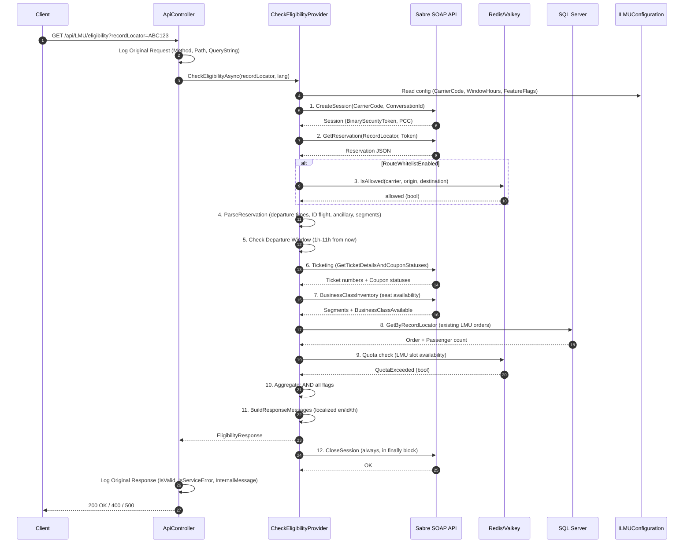

# `/api/LMU/eligibility` Endpoint

## Overview

`GET /api/LMU/eligibility` checks whether a given PNR (Record Locator) is eligible for a Last-Minute Upgrade (LMU) from Economy to Business Class. It validates the reservation against multiple business rules including departure window, flight carrier, ticketing status, seat inventory, quota, and prior upgrades.

## Request

| Parameter      | Type   | Source    | Required | Description                        |
|----------------|--------|-----------|----------|------------------------------------|
| `recordLocator`| string | Query     | Yes      | PNR / record locator (e.g. ABC123) |

**Example:**
```
GET /api/LMU/eligibility?recordLocator=ABC123
```

## Response

### 200 OK / 400 Bad Request / 500 Internal Server Error

```json
{
  "isValid": true,
  "isServiceError": false,
  "internalMessage": "string",
  "responseMessages": {
    "title": "string",
    "message": "string",
    "flag": "OK | Time Window | Warning"
  }
}
```

| Field                        | Type    | Description                                                             |
|------------------------------|---------|-------------------------------------------------------------------------|
| `isValid`                    | bool    | `true` when all eligibility checks pass                                 |
| `isServiceError`             | bool    | `true` when an unhandled exception occurred                             |
| `internalMessage`            | string  | Machine-readable reason code (e.g. `RecordLocatorNotFound`, `OutsideDepartureWindow`) |
| `responseMessages.title`     | string  | Localized title (en/id/th) for the client UI                            |
| `responseMessages.message`   | string  | Localized body text (en/id/th)                                          |
| `responseMessages.flag`      | string  | `OK` = partial upgrade exists, `Time Window` = available at time, `Warning` = not available |

## Business Rules (Eligibility Checks)

All checks must pass for `isValid = true`:

| #  | Check                      | Fail Reason Code               | Description                                                                 |
|----|----------------------------|--------------------------------|-----------------------------------------------------------------------------|
| 1  | Record Locator Found       | `RecordLocatorNotFound`        | Sabre reservation must be retrievable                                       |
| 2  | Route Whitelist            | `RouteNotWhitelisted`          | When `RouteWhitelistEnabled`, carrier+origin+destination must be whitelisted |
| 3  | Has ID Flight              | `NoIdFlight`                   | At least one segment must be operated by the ID carrier                     |
| 4  | Departure Window           | `OutsideDepartureWindow`       | Departure must be within 1h-11h window (or bypassed for whitelisted routes) |
| 5  | Ticket Number Prefix       | `TicketNumberPrefixNotAllowed` | Main ticket numbers must not use disallowed prefixes                        |
| 6  | VCR/Coupon Status          | `VcrStatusNotEligible`         | At least one ticket must have eligible coupon status                        |
| 7  | Business Class Inventory   | `BusinessClassNotAvailable`    | Business class seats must be available on the flight                        |
| 8  | Quota                      | `QuotaExceeded`                | LMU slot quota must not be exceeded for the segment                         |
| 9  | Not Already Business Class | `already business Class`       | Reservation must not already have a business class segment                  |
| 10 | No Ancillary (excl. gr99)  | `HasAncillaryServicesExcl99`   | Configurable: block if ancillary services exist (excluding group 99)        |
| 11 | Single Segment             | `MultipleSegments`             | Configurable: block if reservation has multiple segments                    |
| 12 | No Schedule Change         | `ScheduleChange`               | Block if reservation has schedule change segments                           |

When multiple checks fail, `internalMessage` contains all failure reasons joined by `;`.

## Localized Messages

Response messages are returned in the language detected from the `X-Client-Lang` / `X-Client-Language` request header. Supported: `en`, `id`, `th`.

Special response message variants:

| Condition                          | Flag        | Title Example                                            |
|------------------------------------|-------------|----------------------------------------------------------|
| Partial upgrade exists (X of Y)    | `OK`        | "X dari Y penumpang sudah upgrade"                       |
| All passengers already upgraded    | `OK`        | "Semua penumpang sudah upgrade"                          |
| Before window, available at time   | `Time Window` | "Tersedia Kam, 10 Jul, 09:00"                          |
| Not available                      | `Warning`   | "Tidak Tersedia"                                         |

## Flow Summary

1. **CreateSession** - Open a Sabre SOAP session
2. **GetReservation** - Retrieve the PNR from Sabre
3. **Route Whitelist** - Check if the route is allowed (phased rollout)
4. **Parse Reservation** - Extract departure times, carrier info, ancillary, segments
5. **Departure Window** - Check if departure is within the 1h-11h eligibility window
6. **Ticketing** - Get ticket details and coupon statuses from Sabre
7. **Business Class Inventory** - Check seat availability
8. **Partial Upgrade DB Check** - Check for existing upgrades in LMU orders
9. **Quota Check** - Verify LMU slot availability
10. **Aggregate** - AND all checks together
11. **Build Response** - Localized messages based on all flag combinations
12. **CloseSession** - Clean up Sabre session (always, even on error)

## Sequence Diagram



## Error Handling

| Scenario                    | HTTP Status | `isServiceError` | Behavior                                    |
|-----------------------------|-------------|------------------|---------------------------------------------|
| Empty `recordLocator`       | 400         | false            | Immediate return with validation message    |
| Sabre session creation fail | 200         | false            | `isValid=false`, `internalMessage` reason    |
| PNR not found               | 200         | false            | `isValid=false`, `internalMessage` reason    |
| Unhandled exception         | 500         | true             | `isValid=false`, ServiceError                |
| Sabre session close fail    | -           | -                | Logged as warning, does not affect response  |

## Key Files

| File | Role |
|------|------|
| `API/Controllers/ApiController.cs` | HTTP endpoint, request validation, logging |
| `Application/Providers/CheckEligibilityProvider.cs` | Business logic orchestration |
| `Application/DTOs/EligibilityResponse.cs` | Response + `EligibilityMessageLanguages` models |
| `Application/EligibilityMessageResources.cs` | Localized message text (en/id/th) |
| `Application/Helpers/DepartureEligibilityWindowHelper.cs` | Departure window calculation |
| `Application/Helpers/TicketNumberPrefixHelper.cs` | Ticket prefix validation |
| `Application/Helpers/CouponStatusHelper.cs` | VCR/coupon eligibility check |
| `Application/Helpers/ReservationSegmentHelper.cs` | Ancillary, multi-segment, schedule change detection |
| `Application/Interfaces/IEligibilityProvider.cs` | Provider contract |
| `Infrastructure/SoapAPI/ISabreSoapService.cs` | Sabre SOAP client interface |
