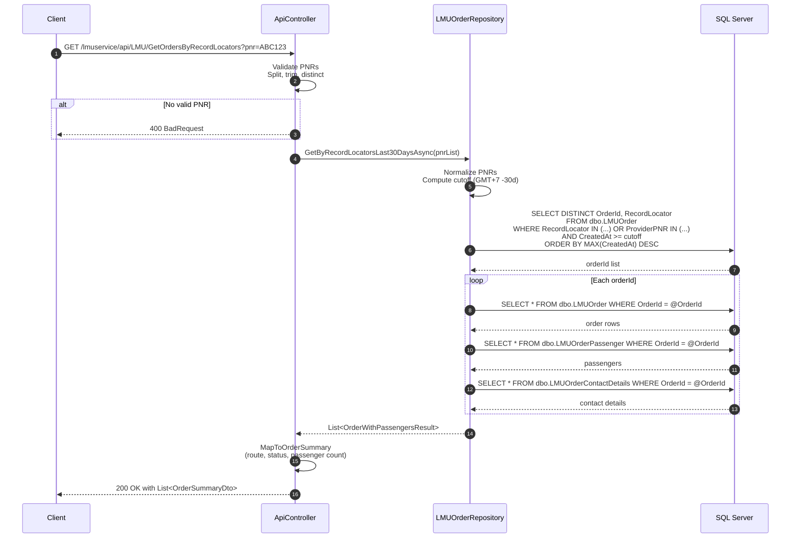

# GetOrdersByRecordLocators Endpoint Flow

## Overview

`GET /lmuservice/api/LMU/GetOrdersByRecordLocators` retrieves a summarized list of LMU (Last-Minute Upgrade) orders matching one or more PNRs / record locators. Results are limited to orders created within the last **30 days** and are grouped by `OrderId` and `RecordLocator`, ordered by newest first.

The endpoint can match either:

- `RecordLocator` — the booking PNR
- `ProviderPNR` — the airline / provider PNR

---

## HTTP Contract

| Item | Value |
|------|-------|
| Method | `GET` |
| Path | `/lmuservice/api/LMU/GetOrdersByRecordLocators` |
| Query parameter | `pnr` (required, repeatable) |
| Response | `200 OK` — `IReadOnlyList<OrderSummaryDto>` |
| Error | `400 BadRequest` — when no valid PNR is supplied |

**Example request**

```bash
curl -X GET "http://localhost:8000/lmuservice/api/LMU/GetOrdersByRecordLocators?pnr=ABC123&pnr=DEF456" \
  -H "Accept: application/json"
```

---

## Flow Description

```mermaid
flowchart LR
    Client([Client / UI])
    API[APIController\nGetOrdersByRecordLocators]
    Repo[LMUOrderRepository\nGetByRecordLocatorsLast30DaysAsync]
    DB[(SQL Server\nLMUData.dbo)]

    Client -->|GET ?pnr=...| API
    API -->|validate PNRs| API
    API -->|pnrList| Repo
    Repo -->|SELECT OrderId\nWHERE RecordLocator/ProviderPNR IN (...)\nAND CreatedAt >= cutoff| DB
    DB -->|distinct OrderIds| Repo
    Repo -->|per OrderId\nGetByOrderIdAsync| DB
    DB -->|LMUOrder + Passengers + ContactDetails| Repo
    Repo -->|OrderWithPassengersResult[]| API
    API -->|MapToOrderSummary| API
    API -->|OrderSummaryDto[]| Client
```

### Step-by-step

1. **Request arrival**
   - The client sends a `GET` request to `ApiController.GetOrdersByRecordLocators` with one or more `pnr` query values.
   - The controller is decorated with `[Route("api/LMU")]` and `[HttpGet("GetOrdersByRecordLocators")]`.

2. **Input validation**
   - The controller checks that at least one `pnr` value is provided.
   - PNRs are split by commas (to support `?pnr=ABC123,DEF456`), trimmed, made distinct, and re-validated.
   - If no valid PNR remains, the controller returns `400 BadRequest` with the message `"At least one valid PNR is required"`.

3. **Repository call**
   - The controller calls `ILMUOrderRepository.GetByRecordLocatorsLast30DaysAsync(pnrList, cancellationToken)`.

4. **Repository normalization**
   - `LMUOrderRepository` reads the connection string from `LMUData:ConnectionString` (or the environment variable `LMUData__ConnectionString`).
   - PNRs are normalized again: trimmed, upper-cased, and deduplicated.
   - A 30-day cutoff is calculated using `DateTimeHelper.GetNowGmt7().AddDays(-30)`.

5. **Find matching orders**
   - A SQL query selects distinct `OrderId` / `RecordLocator` pairs from `dbo.LMUOrder` where either `RecordLocator` or `ProviderPNR` matches any supplied PNR **and** `CreatedAt >= @Cutoff`.
   - Results are ordered by `MAX(CreatedAt) DESC` so the newest order per PNR appears first.

6. **Hydrate order details**
   - For each `OrderId` returned, the repository calls `GetByOrderIdAsync`, which executes three queries:
     - `dbo.LMUOrder` — full order rows (flight, status, amounts, booking code, etc.)
     - `dbo.LMUOrderPassenger` — passenger list
     - `dbo.LMUOrderContactDetails` — contact details
   - The three result sets are combined into an `OrderWithPassengersResult` object.

7. **Map to summary DTO**
   - The controller maps each `OrderWithPassengersResult` to an `OrderSummaryDto` using `MapToOrderSummary`:
     - `Status` — localized display text (e.g. `"Selesai"` for `FULFILLED`)
     - `Title` — localized service title
     - `Route` — built from the first segment's `DepartureCode` and the last segment's `ArrivalCode` (e.g. `CGK → KNO`)
     - `RecordLocator` / `ProviderPNR` — from the first order row
     - `PassengerCount` — taken from `Qty`
     - `BookingCode` — from the order row
     - `CreatedAt` — minimum `CreatedAt` across the order rows
     - `ItineraryId` — from the order row

8. **Response**
   - The controller returns `200 OK` with the list of `OrderSummaryDto` objects.

---

## Data Model

### Request

- `pnr` (string, repeated) — one or more record locators / PNRs.

### Response: `OrderSummaryDto`

| Field | Description |
|-------|-------------|
| `Status` | Localized status label for UI display |
| `Title` | Localized service title |
| `Route` | Departure → arrival airport codes |
| `RecordLocator` | Booking PNR |
| `ProviderPNR` | Airline / provider PNR |
| `PassengerCount` | Number of passengers (`Qty`) |
| `BookingCode` | 10-character LMU booking code |
| `CreatedAt` | Order creation timestamp |
| `ItineraryId` | Itinerary identifier from the booking service |

### Internal result: `OrderWithPassengersResult`

- `Orders` — `IReadOnlyList<LMUOrder>`
- `Passengers` — `IReadOnlyList<LMUOrderPassenger>`
- `ContactDetails` — `LMUOrderContactDetails?`

---

## Error Scenarios

| Scenario | HTTP Status | Response |
|----------|-------------|----------|
| No `pnr` provided | `400 BadRequest` | `{ "message": "At least one PNR is required" }` |
| Only empty/whitespace PNRs after normalization | `400 BadRequest` | `{ "message": "At least one valid PNR is required" }` |
| `LMUData:ConnectionString` not configured | `500` | `InvalidOperationException` thrown by repository |

---

## Sequence Diagram



---

## Performance Notes

- The initial query is filtered by a 30-day `CreatedAt` window and uses the indexes defined in migration `202603240001_AddLMUOrderRecordLocatorProviderPnrIndexes`.
- The repository issues one query per matched `OrderId` to hydrate full details. If a large number of orders match the PNRs, consider pagination or a bulk-fetch optimization.
- `GROUP BY o.OrderId, o.RecordLocator` ensures each (OrderId, PNR) tuple is returned at most once.

---

## Related Files

- `API/Controllers/ApiController.cs` — endpoint implementation
- `Infrastructure/Data/LMUOrderRepository.cs` — repository SQL logic
- `Application/DTOs/OrderSummaryDto.cs` — response DTO
- `Application/DTOs/OrderWithPassengersResult.cs` — internal result DTO
- `Application/Models/LMUOrder.cs` — order entity
- `Infrastructure/Data/Migrations/202603240001_AddLMUOrderRecordLocatorProviderPnrIndexes.cs` — supporting indexes
