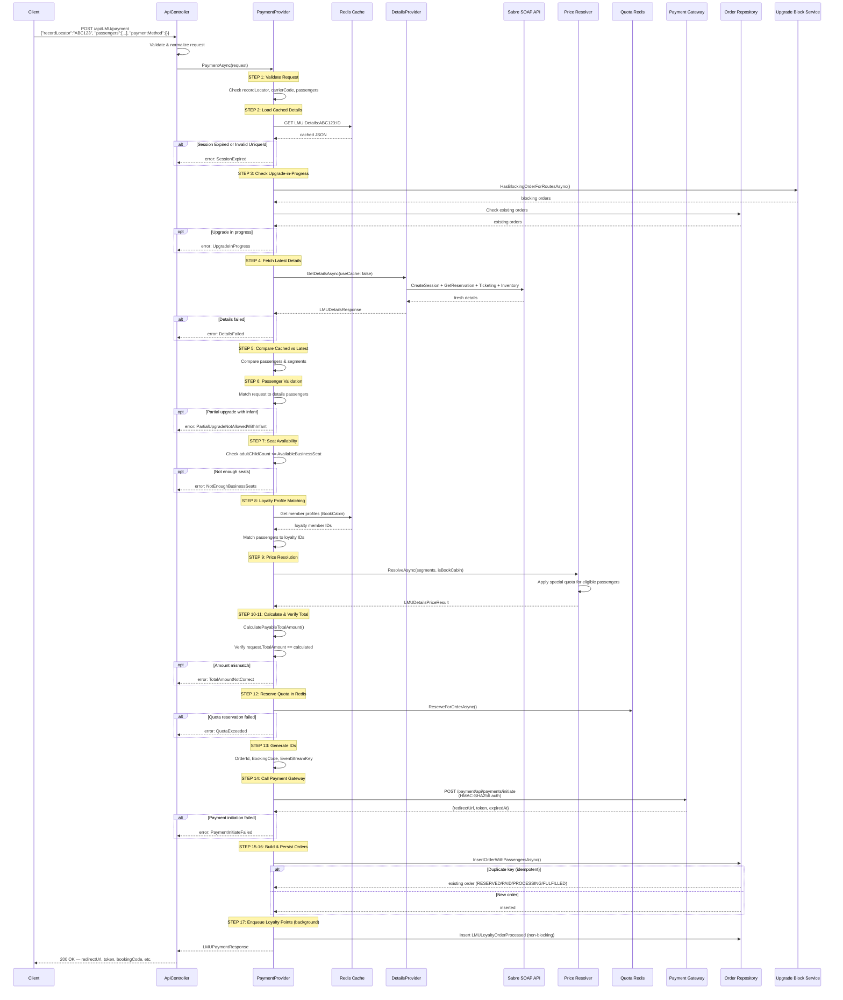

# POST `/api/LMU/payment` — Endpoint Flow

## Overview

Processes payment for an LMU (Last-Minute Upgrade) upgrade: validates cached details, checks for duplicate upgrades, resolves pricing, initiates payment via gateway, persists order records, and returns checkout URL.

| Property      | Value                                       |
| ------------- | ------------------------------------------- |
| Method        | `POST`                                      |
| Route         | `api/LMU/payment`                           |
| Auth          | Optional (affects special quota pricing)    |
| Request Body  | `LMUPaymentRequest`                         |
| Response      | `LMUPaymentResponse` (200/400)              |
| Cache         | Redis (`LMU:Details:{pnr}:{carrier}`)       |
| Session       | Sabre SOAP (via DetailsProvider)            |

---

## Request / Response

### Request — `LMUPaymentRequest`

```json
{
  "recordLocator": "ABC123",
  "passengers": [
    {
      "firstName": "John",
      "lastName": "Doe",
      "passengerNumber": 1,
      "nameId": "1",
      "note": "ADT",
      "isUseFreeQuota": false
    }
  ],
  "paymentMethod": {
    "paymentMethodId": "credit_card",
    "paymentProvider": "stripe",
    "displayName": "Credit Card",
    "totalAmount": 350000,
    "currencyCode": "IDR"
  }
}
```

| Field                          | Type       | Required | Notes                                    |
| ------------------------------ | ---------- | -------- | ---------------------------------------- |
| `recordLocator`                | `string`   | Yes      | PNR / record locator (trimmed & uppered) |
| `passengers`                   | `list`     | Yes      | Passengers to upgrade (≥1)               |
| `passengers[].firstName`      | `string`   | Yes      | Must match reservation name              |
| `passengers[].lastName`       | `string`   | Yes      | Must match reservation name              |
| `passengers[].passengerNumber`| `int`      | Yes      | Passenger number from reservation        |
| `passengers[].nameId`         | `string`   | Yes      | Name ID from reservation                 |
| `passengers[].note`           | `string`   | Yes      | Passenger type (ADT/CNN/INF)             |
| `passengers[].isUseFreeQuota` | `bool`     | Yes      | Whether to use special free quota        |
| `paymentMethod`               | `object`   | Yes      | Payment method details                   |
| `paymentMethod.paymentMethodId`| `string`  | Yes      | Payment method identifier                |
| `paymentMethod.paymentProvider`| `string`  | Yes      | Payment provider name                    |
| `paymentMethod.displayName`   | `string`   | Yes      | Display name for payment method          |
| `paymentMethod.totalAmount`   | `decimal`  | Yes      | Total amount to charge                   |
| `paymentMethod.currencyCode`  | `string`   | Yes      | Currency code (e.g., "IDR")              |

### Response — `LMUPaymentResponse`

```json
{
  "isSuccess": true,
  "message": null,
  "redirectUrl": "https://checkout.payment.com/abc123",
  "token": "pay_token_xyz",
  "expiryMinutes": 15,
  "bookingCode": "BK1234",
  "cabinPoints": 100,
  "qrString": "upgradedata://...",
  "id": "10ABC123XYZ",
  "expiredAt": "2026-08-19T10:30:00Z",
  "eventStreamKey": "order:10ABC123XYZ"
}
```

| Field            | Type     | Notes                                          |
| ---------------- | -------- | ---------------------------------------------- |
| `isSuccess`      | `bool`   | Whether payment initiation succeeded           |
| `message`        | `object` | Error details (null on success)                |
| `message.errorCode` | `int` | Numeric error code (3000-3013)                 |
| `message.title`  | `string` | Error title                                    |
| `message.description` | `string` | Error description                          |
| `redirectUrl`    | `string` | Payment gateway checkout URL                   |
| `token`          | `string` | Payment token for tracking                     |
| `expiryMinutes`  | `int`    | Minutes until payment session expires          |
| `bookingCode`    | `string` | Generated booking code                         |
| `cabinPoints`    | `int`    | Cabin points earned                            |
| `qrString`       | `string` | QR code string for payment                     |
| `id`             | `string` | Order ID (format: "10" + base36 timestamp + random) |
| `expiredAt`      | `string` | ISO 8601 expiry timestamp                      |
| `eventStreamKey` | `string` | Redis key for real-time order status stream    |

### Error Codes (InternalMessage → ErrorCode)

| InternalMessage              | ErrorCode                  | HTTP |
| ---------------------------- | -------------------------- | ---- |
| `RecordLocatorRequired`      | `RecordLocatorRequired`    | 400  |
| `CarrierCodeRequired`        | `CarrierCodeRequired`      | 400  |
| `NoPassengersSelected`       | `NoPassengersSelected`     | 400  |
| `RequestRequired`            | `RequestRequired`          | 400  |
| `SessionExpired`             | `SessionExpired`           | 400  |
| `DetailsFailed`              | `DetailsFailed`            | 400  |
| `BusinessClassFull`          | `BusinessClassFull`        | 400  |
| `QuotaExceeded`              | `QuotaExceeded`            | 400  |
| `UpgradeInProgress`          | `UpgradeInProgress`        | 400  |
| `TotalAmountNotCorrect`      | `TotalAmountNotCorrect`    | 400  |
| `PaymentInitiateFailed`      | `PaymentInitiateFailed`    | 400  |
| `PartialUpgradeNotAllowedWithInfant` | `PartialUpgradeNotAllowedWithInfant` | 400 |
| `NotEnoughBusinessSeats`     | `NotEnoughBusinessSeats`   | 400  |
| `OrderInsertFailed`          | `OrderInsertFailed`        | 400  |

---

## Flow Diagram

```
┌─────────────────────────────────────────────────────────────────────────┐
│                      Client  POST /api/LMU/payment                     │
│  { "recordLocator": "ABC123", "passengers": [...], "paymentMethod": {} }│
└───────────────────────────────┬─────────────────────────────────────────┘
                                │
                                ▼
┌─────────────────────────────────────────────────────────────────────────┐
│  ApiController.Payment()                                                │
│  ├─ Validate request (null check, recordLocator required)              │
│  ├─ Normalize: trim + uppercase                                        │
│  └─ Call _paymentProvider.PaymentAsync()                               │
└───────────────────────────────┬─────────────────────────────────────────┘
                                │
                                ▼
┌─────────────────────────────────────────────────────────────────────────┐
│  LMUPaymentProvider.PaymentAsync()                                      │
│                                                                         │
│  ┌──────────────────────────────────────────────────────────────────┐   │
│  │ STEP 1: VALIDATE REQUEST                                         │   │
│  │ ├─ Null check on request                                         │   │
│  │ ├─ recordLocator required (not empty)                            │   │
│  │ ├─ carrierCode required (from cached details or request)        │   │
│  │ └─ passengers count > 0                                          │   │
│  └──────────────────────────┬───────────────────────────────────────┘   │
│                             │                                           │
│                             ▼                                           │
│  ┌──────────────────────────────────────────────────────────────────┐   │
│  │ STEP 2: LOAD CACHED DETAILS                                      │   │
│  │ ├─ Cache key: LMU:Details:{recordLocator}:{carrierCode}         │   │
│  │ ├─ Validate session not expired (BatasPemesananStartedAt)       │   │
│  │ ├─ Validate UniqueId matches                                     │   │
│  │ └─ On miss/expired → InternalMessage="SessionExpired" → return  │   │
│  └──────────────────────────┬───────────────────────────────────────┘   │
│                             │                                           │
│                             ▼                                           │
│  ┌──────────────────────────────────────────────────────────────────┐   │
│  │ STEP 3: CHECK UPGRADE-IN-PROGRESS                                │   │
│  │ ├─ UpgradeBlockService.HasBlockingOrderForRoutesAsync()          │   │
│  │ ├─ Check LMUOrderRepository for existing orders                  │   │
│  │ ├─ Compare passenger overlap (same name + passengerNumber)       │   │
│  │ └─ If overlap found → InternalMessage="UpgradeInProgress" → return│  │
│  └──────────────────────────┬───────────────────────────────────────┘   │
│                             │                                           │
│                             ▼                                           │
│  ┌──────────────────────────────────────────────────────────────────┐   │
│  │ STEP 4: FETCH LATEST DETAILS (fresh Sabre data)                 │   │
│  │ ├─ _detailsProvider.GetDetailsAsync(useCache: false)             │   │
│  │ └─ On failure → InternalMessage="DetailsFailed" → return        │   │
│  └──────────────────────────┬───────────────────────────────────────┘   │
│                             │                                           │
│                             ▼                                           │
│  ┌──────────────────────────────────────────────────────────────────┐   │
│  │ STEP 5: COMPARE CACHED VS LATEST                                 │   │
│  │ ├─ Compare passengers (firstName + lastName match)               │   │
│  │ ├─ Compare segments (flight number, route, times)                │   │
│  │ └─ On mismatch → InternalMessage="DetailsFailed" → return       │   │
│  └──────────────────────────┬───────────────────────────────────────┘   │
│                             │                                           │
│                             ▼                                           │
│  ┌──────────────────────────────────────────────────────────────────┐   │
│  │ STEP 6: PASSENGER VALIDATION                                     │   │
│  │ ├─ Match request passengers to details passengers                │   │
│  │ ├─ Validate name matching (firstName + lastName)                 │   │
│  │ ├─ Count adult/child vs infant                                   │   │
│  │ └─ If infant with partial upgrade → InternalMessage=             │   │
│  │    "PartialUpgradeNotAllowedWithInfant" → return                 │   │
│  └──────────────────────────┬───────────────────────────────────────┘   │
│                             │                                           │
│                             ▼                                           │
│  ┌──────────────────────────────────────────────────────────────────┐   │
│  │ STEP 7: SEAT AVAILABILITY CHECK                                  │   │
│  │ ├─ adultChildCount = passengers excluding infants                │   │
│  │ ├─ Compare with AvailableBusinessSeat from cached details        │   │
│  │ └─ If insufficient → InternalMessage=                            │   │
│  │    "NotEnoughBusinessSeats" → return                             │   │
│  └──────────────────────────┬───────────────────────────────────────┘   │
│                             │                                           │
│                             ▼                                           │
│  ┌──────────────────────────────────────────────────────────────────┐   │
│  │ STEP 8: LOYALTY PROFILE MATCHING                                 │   │
│  │ ├─ Fetch member profiles from Redis cache (BookCabin)            │   │
│  │ ├─ Match passenger names to loyalty member IDs                   │   │
│  │ └─ Set isSpecialQuotaEligible flag per passenger                 │   │
│  └──────────────────────────┬───────────────────────────────────────┘   │
│                             │                                           │
│                             ▼                                           │
│  ┌──────────────────────────────────────────────────────────────────┐   │
│  │ STEP 9: PRICE RESOLUTION (LMUDetailsPriceResolver)             │   │
│  │ ├─ Resolve pricing via LMUPriceRule + QuotaRule                  │   │
│  │ ├─ Apply special quota for eligible passengers (if authenticated)│   │
│  │ └─ Set: Price, Currency, CabinPoints, IsSpecialQuotaAvailable    │   │
│  └──────────────────────────┬───────────────────────────────────────┘   │
│                             │                                           │
│                             ▼                                           │
│  ┌──────────────────────────────────────────────────────────────────┐   │
│  │ STEP 10: CALCULATE TOTAL                                         │   │
│  │ ├─ CalculatePayableTotalAmount()                                 │   │
│  │ ├─ Apply special price count for eligible passengers             │   │
│  │ ├─ Sum per-segment pricing                                       │   │
│  │ └─ Zero-price guard: if totalAmount == 0, re-resolve without    │   │
│  │    special quota                                                 │   │
│  └──────────────────────────┬───────────────────────────────────────┘   │
│                             │                                           │
│                             ▼                                           │
│  ┌──────────────────────────────────────────────────────────────────┐   │
│  │ STEP 11: VERIFY AMOUNT MATCH                                     │   │
│  │ ├─ Compare request.PaymentMethod.TotalAmount with calculated    │   │
│  │ └─ If mismatch → InternalMessage="TotalAmountNotCorrect" → return│  │
│  └──────────────────────────┬───────────────────────────────────────┘   │
│                             │                                           │
│                             ▼                                           │
│  ┌──────────────────────────────────────────────────────────────────┐   │
│  │ STEP 12: RESERVE QUOTA IN REDIS                                  │   │
│  │ ├─ QuotaRedis.ReserveForOrderAsync()                             │   │
│  │ ├─ Prevents overselling of limited seats                         │   │
│  │ └─ On failure → InternalMessage="QuotaExceeded" → return        │   │
│  └──────────────────────────┬───────────────────────────────────────┘   │
│                             │                                           │
│                             ▼                                           │
│  ┌──────────────────────────────────────────────────────────────────┐   │
│  │ STEP 13: GENERATE IDS                                            │   │
│  │ ├─ OrderId = "10" + base36(timestamp) + random                  │   │
│  │ ├─ BookingCode = random alphanumeric                            │   │
│  │ └─ EventStreamKey = "order:{orderId}"                           │   │
│  └──────────────────────────┬───────────────────────────────────────┘   │
│                             │                                           │
│                             ▼                                           │
│  ┌──────────────────────────────────────────────────────────────────┐   │
│  │ STEP 14: CALL PAYMENT GATEWAY                                    │   │
│  │ ├─ PaymentGatewayClient.InitiateAsync()                          │   │
│  │ ├─ POST /payment/api/payments/initiate                           │   │
│  │ ├─ HMAC-SHA256 authentication                                    │   │
│  │ ├─ Returns: redirectUrl, token, expiredAt                        │   │
│  │ └─ On failure → InternalMessage="PaymentInitiateFailed" → return │   │
│  └──────────────────────────┬───────────────────────────────────────┘   │
│                             │                                           │
│                             ▼                                           │
│  ┌──────────────────────────────────────────────────────────────────┐   │
│  │ STEP 15: BUILD ORDER RECORDS                                     │   │
│  │ ├─ Per-segment LMUOrder with amounts, status="RESERVED"         │   │
│  │ ├─ LMUOrderPassenger with loyalty IDs, ticket numbers           │   │
│  │ └─ Contact details from passenger info                          │   │
│  └──────────────────────────┬───────────────────────────────────────┘   │
│                             │                                           │
│                             ▼                                           │
│  ┌──────────────────────────────────────────────────────────────────┐   │
│  │ STEP 16: PERSIST TO DATABASE                                     │   │
│  │ ├─ InsertOrderWithPassengersAsync() (order + passengers)         │   │
│  │ ├─ Idempotent retry on duplicate key (SqlException 2627)        │   │
│  │ │   └─ Treat existing RESERVED/PAID/PROCESSING/FULFILLED as success│ │
│  │ └─ On other failure → InternalMessage="OrderInsertFailed" → return│  │
│  └──────────────────────────┬───────────────────────────────────────┘   │
│                             │                                           │
│                             ▼                                           │
│  ┌──────────────────────────────────────────────────────────────────┐   │
│  │ STEP 17: ENQUEUE LOYALTY POINTS                                  │   │
│  │ ├─ Non-blocking LMULoyaltyOrderProcessed insert                  │   │
│  │ └─ Background processing (not critical path)                     │   │
│  └──────────────────────────┬───────────────────────────────────────┘   │
│                             │                                           │
│                             ▼                                           │
│              Return LMUPaymentResponse (200 OK)                        │
│              { redirectUrl, token, bookingCode, cabinPoints, id, ... }  │
└─────────────────────────────────────────────────────────────────────────┘
```

---

## Mermaid Sequence Diagram



---

## Key Dependencies

| Service                        | Purpose                                            | Called At      |
| ------------------------------ | -------------------------------------------------- | -------------- |
| `ILMUDetailsProvider`          | Cache read/write, fresh details fetch              | Steps 2,4,5    |
| `ILMUDetailsPriceResolver`     | Price computation via LMUPriceRule + QuotaRule     | Step 9         |
| `IPaymentGateway` (PaymentGatewayClient) | Initiate payment with external service | Step 14        |
| `IOrderIdGenerator`            | Generate order ID from UniqueId + itinerary + payment method | Step 13 |
| `IBookingCodeGenerator`        | Generate random booking code                       | Step 13        |
| `ILMUOrderRepository`         | Persist orders, check existing orders              | Steps 3,16,17  |
| `ILMUQuotaRepository`         | Quota rule resolution, usage persistence           | Step 12        |
| `IQuotaRedisService`          | Redis quota reservation (prevents overselling)     | Step 12        |
| `ILMUCacheService` (Redis)    | Details cache, member profiles                     | Steps 2,8      |
| `IUpgradeBlockService`        | Check for existing in-progress upgrades            | Step 3         |
| `ILMUTestPaymentOverrideRepository` | Debug/test override (force Rp 1)            | Step 11        |

## Key Configuration Values

| Config                                         | Purpose                                          |
| ---------------------------------------------- | ------------------------------------------------ |
| `PaymentServiceConfig:BaseUrl`                 | Payment service base URL                         |
| `PaymentServiceConfig:Secret`                  | HMAC auth secret for payment gateway             |
| `PaymentServiceConfig:ProductType`             | Default "LMU"                                    |
| `PaymentServiceConfig:ProductProvider`         | Default "SabrePSS"                               |
| `PaymentServiceConfig:CheckoutWebCallback`     | Success redirect URL base                        |
| `CacheTtlMinutes`                              | Redis TTL for details cache                      |
| `CabinPointsPercentage`                        | % of pricePerPax to convert to cabin points      |
| `TestPaymentOverrideEnabled`                   | Enable debug force-Rp1 mode                      |
| `PreventPartialUpgradeWithInfantEnabled`       | Block partial upgrade when infant present        |
| `LMUSpecialOffersMinAppVersionAndroid`         | Min Android version for special offers           |
| `LMUSpecialOffersMinAppVersionIos`             | Min iOS version for special offers               |
| `IsLMUSpecialOffersEnable`                     | Feature flag for special offers                  |

---

## External API Calls

| Endpoint                              | Method | Auth              | Purpose                        |
| -------------------------------------- | ------ | ----------------- | ------------------------------ |
| `/payment/api/payments/initiate`       | POST   | HMAC-SHA256       | Initiate payment checkout      |
| `/payment/api/payments/methods`        | POST   | Bearer token      | Fetch available payment methods (Prepare flow) |
