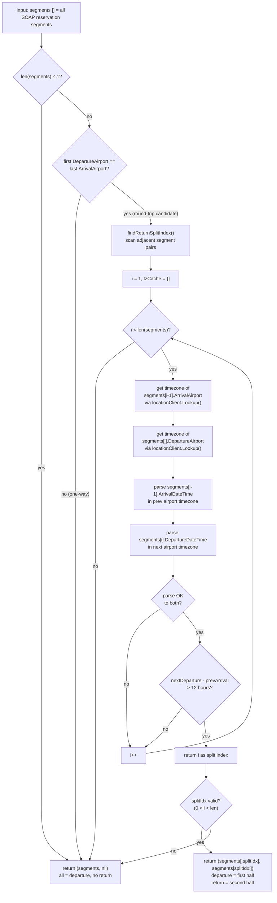

# Segment Journey Classification (Departure vs Return)

## Flowchart

## Summary

**Location:** `internal/service/details.go:400-456`

The function `groupSegmentsForJourney` classifies all reservation segments into **departure** and **return** journeys:

1. **Single/one segment** → all departure, no return.
2. **One-way** (first segment departure ≠ last segment arrival airport) → all departure, no return.
3. **Round-trip** → scan adjacent segment pairs. For each pair, resolve airport timezones via the location client, parse arrival/departure times, and **split at the first gap > 12 hours** between the previous segment's arrival and the next segment's departure.

If no gap > 12 hours is found, all segments are treated as departure (no return).

## Callers

| Caller | File | Purpose |
|--------|------|---------|
| `GetDetails` | `details.go:148` | Build departure + optional return journey addons |
| `prepare_validate` | `prepare_validate.go:40` | Validate ancillaries against correct segment group |
| `buildOrderRequest` | `prepare_order.go:198` | Build order payload with trip direction |
